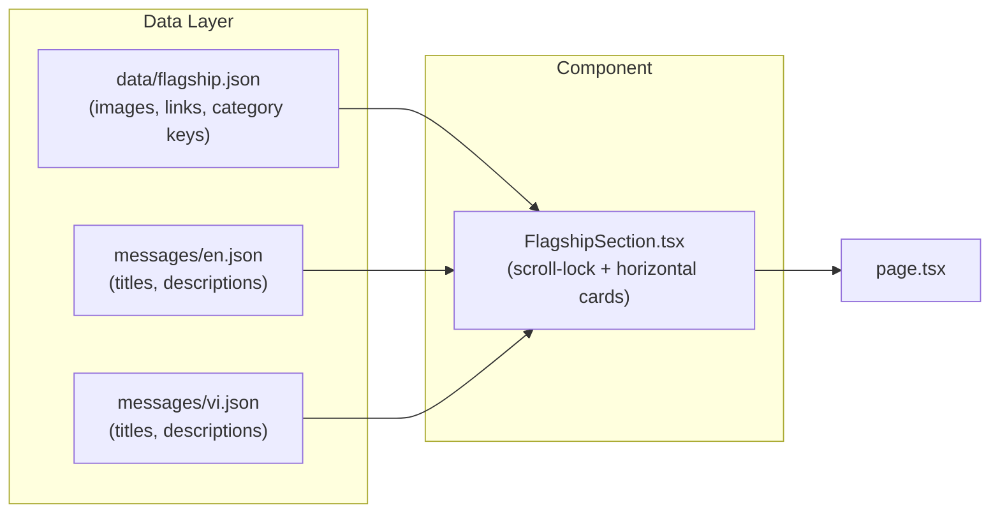

# Flagship Products Section

## Architecture




## Data Structure

### 1. Product data file: `client/data/flagship.json`

A simple array of products. To update flagship products, just edit this file (or later, via an admin UI):

```json
[
  {
    "id": "racket-2026",
    "category": "racket",
    "image": "/images/flagship/racket-2026.jpg",
    "href": "/products/racket-2026"
  },
  {
    "id": "sponge-pro",
    "category": "sponge",
    "image": "/images/flagship/sponge-pro.jpg",
    "href": "/products/sponge-pro"
  },
  {
    "id": "apparel-collection",
    "category": "clothing",
    "image": "/images/flagship/apparel-2026.jpg",
    "href": "/products/apparel-collection"
  }
]
```

### 2. Translation keys in [messages/en.json](client/messages/en.json) and [messages/vi.json](client/messages/vi.json)

Add a `"flagship"` section with a heading and per-product text keyed by `id`:

```json
{
  "flagship": {
    "heading": "Flagship Products",
    "racket-2026": {
      "title": "Pro Racket 2026",
      "description": "The latest competition-grade racket."
    },
    "sponge-pro": {
      "title": "SpinMax Sponge",
      "description": "Maximum spin, maximum control."
    },
    "apparel-collection": {
      "title": "2026 Apparel Collection",
      "description": "Performance wear for champions."
    }
  }
}
```

When a product is added/removed from `flagship.json`, the corresponding translation key is added/removed in the message files.

## Component: `FlagshipSection.tsx`

A new client component at [client/src/components/FlagshipSection.tsx](client/src/components/FlagshipSection.tsx).

**Scroll-lock behavior (using Framer Motion):**

- The section takes up full viewport height
- When the user scrolls into it, the page scroll "locks" (the section is pinned via `position: sticky`)
- Wheel/touch events are captured to scroll through cards horizontally, one at a time
- After the last card is shown, the page unlocks and normal scrolling resumes
- The section height is set to `100vh * (number of cards)` so it occupies enough scroll distance for the pin effect

**Card design:**

- Each card shows the product image, category tag, title, and description
- Animated entrance using `framer-motion` (already installed)
- Progress dots or a subtle indicator showing which card is active

## Page Integration

In [page.tsx](client/src/app/[locale]/page.tsx), add `<FlagshipSection />` below `<HeroVideo />`:

```tsx
<main>
  <HeroVideo />
  <FlagshipSection />
</main>
```

## Placeholder Images

Since real product images don't exist yet, the component will use placeholder styling (gradient backgrounds with the category name) so you can see the layout. Replace with real images later by updating `flagship.json`.