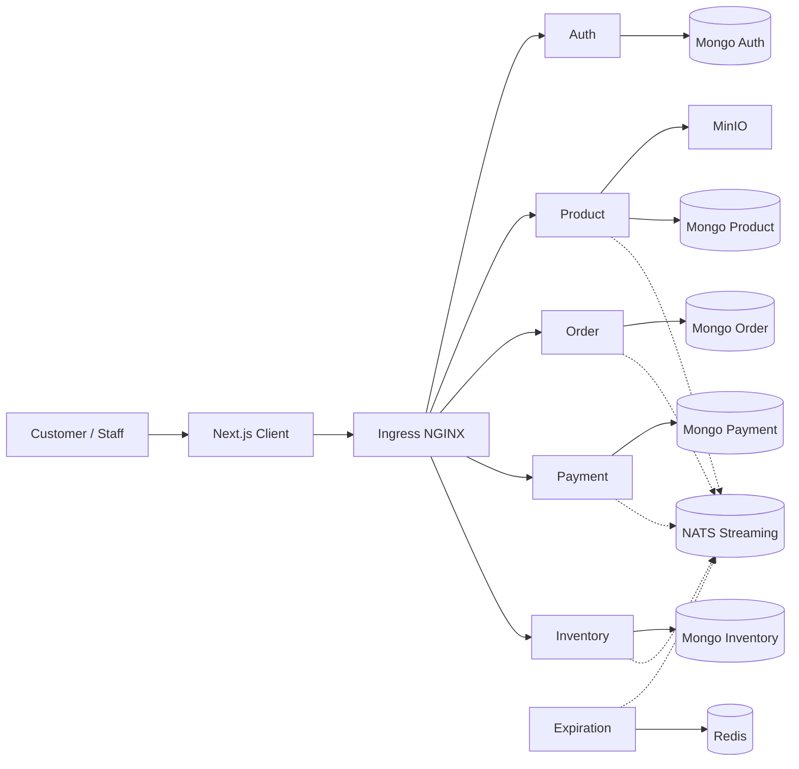

# System Architecture

| Field | Value |
|-------|-------|
| **Version** | 0.1 |
| **Status** | Draft |
| **Last updated** | 2026-08-02 |

---

## 1. Context

TableTennisShop is a microservices e-commerce system for table tennis equipment. Clients (browser / Next.js) call HTTP APIs via an ingress; services sync asynchronously over NATS Streaming.

## 2. Containers (logical)

| Container | Responsibility | Datastore |
|-----------|----------------|-----------|
| Auth | Identity, JWT cookie session | Mongo |
| Product | Catalog, media metadata, MinIO | Mongo + MinIO |
| Order | Orders, analytics | Mongo |
| Payment | Payment records / events | Mongo |
| Inventory | Stock, imports | Mongo |
| Expiration | Unpaid order timers | Redis |
| Config | Landing/CMS-style settings | Mongo |
| Client | Storefront UI | — |
| NATS Streaming | Event bus | — |

## 3. Integration style

- **Sync:** REST over HTTP through ingress path prefixes (`/api/users`, `/api/products`, …).
- **Async:** Domain events on NATS subjects (see [EVENT_ARCHITECTURE.md](./EVENT_ARCHITECTURE.md)).
- **Consistency:** Optimistic concurrency via `version` on event payloads / documents.

## 4. Deployment view (local)

- Orchestration: Kubernetes (Docker Desktop **kubeadm** recommended for local image sharing).
- Dev loop: Skaffold (`skaffold.yaml` full; `skaffold-minio.yaml` slim).
- Details: [INFRA_DOCUMENT.md](./INFRA_DOCUMENT.md).

## 5. Key decisions

See [adr/](./adr/).

## 6. Known architectural risks

| Risk | Mitigation |
|------|------------|
| NATS Streaming is legacy | ADR; plan migration path |
| Many Mongo pods = high RAM | Slim Skaffold profiles |
| Ingress admission webhook flaky on Docker Desktop | Runbook: delete validating webhook for local |
| Single replica everywhere | Accept for MVP; document before prod |
