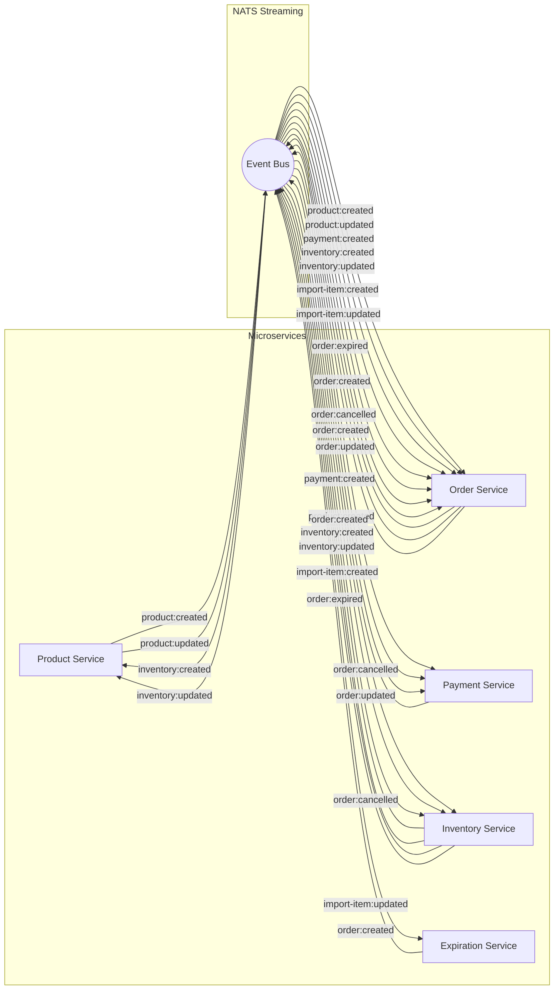
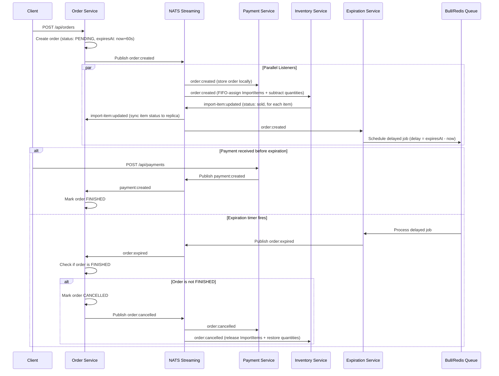
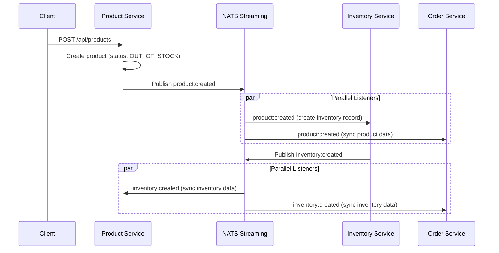
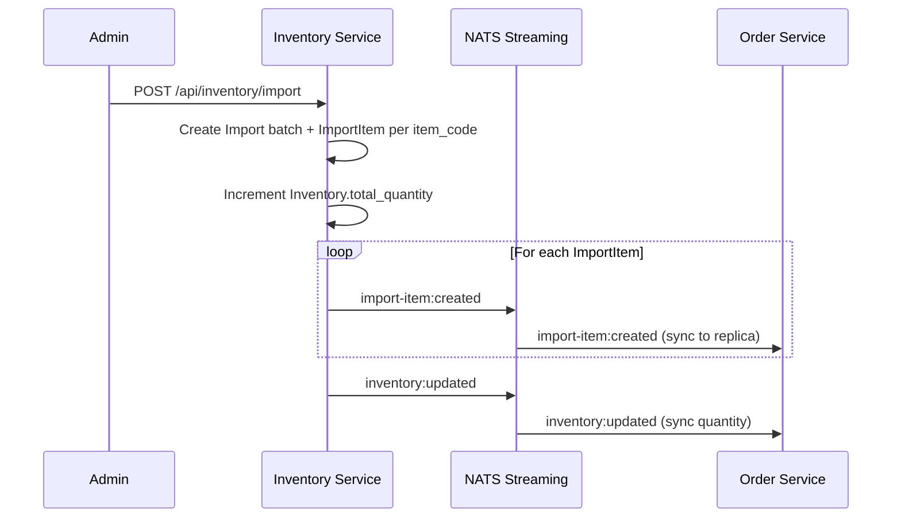

# Event-Driven Architecture Documentation

This document describes the cross-service event flow, event catalog, and messaging patterns used in TableTennisShop.

---

## 1. Overview

TableTennisShop uses **NATS Streaming** as its event bus. Services communicate asynchronously by publishing and subscribing to typed events. Each service maintains its own database and synchronizes state through events (event sourcing / CQRS-lite pattern).

| Aspect | Detail |
|--------|--------|
| **Message broker** | NATS Streaming (`nats-streaming:0.17.0`) |
| **Cluster ID** | `ticketing` |
| **Client library** | `node-nats-streaming` |
| **Concurrency** | Optimistic concurrency via `version` field |
| **Delivery** | At-least-once with manual ACK |

---

## 2. Service Communication Map



> The **Auth service** does not participate in NATS messaging.

---

## 3. Event Catalog

### 3.1 Product Events

| Subject | Publisher | Subscribers | Payload |
|---------|----------|-------------|---------|
| `product:created` | Product | Order, Inventory | `{ _id, status, price, version }` |
| `product:updated` | Product | Order | `{ _id, status, price, version }` |

---

### 3.2 Order Events

| Subject | Publisher | Subscribers | Payload |
|---------|----------|-------------|---------|
| `order:created` | Order | Payment, Inventory, Expiration | `{ _id, user_id, products[], status, payment_method, total_price, expiresAt, version }` |
| `order:updated` | Order | Payment | `{ _id, user_id, products[], status, payment_method, total_price, expiresAt, version }` |
| `order:cancelled` | Order | Payment, Inventory | `{ _id, user_id, products[], status, payment_method, total_price, expiresAt, version }` |
| `order:expired` | Expiration | Order | `{ _id }` |

> **Note:** `products[]` items now include `item_codes: string[]` alongside `product_id`, `price`, and `quantity`.

---

### 3.3 Payment Events

| Subject | Publisher | Subscribers | Payload |
|---------|----------|-------------|---------|
| `payment:created` | Payment | Order | `{ _id, order_id, user_id }` |

---

### 3.4 Inventory Events

| Subject | Publisher | Subscribers | Payload |
|---------|----------|-------------|---------|
| `inventory:created` | Inventory | Product, Order | `{ _id, product_id, total_quantity, version }` |
| `inventory:updated` | Inventory | Product, Order | `{ _id, product_id, total_quantity, version }` |

---

### 3.5 Import Events

| Subject | Publisher | Subscribers | Payload |
|---------|----------|-------------|---------|
| `import-item:created` | Inventory | Order | `{ _id, import_id, product_id, item_code, import_price, status, version }` |
| `import-item:updated` | Inventory | Order | `{ _id, import_id, product_id, item_code, import_price, status, order_id?, sold_at?, version }` |

---

## 4. Order Lifecycle Flow

The most complex event flow in the system is the order lifecycle:



---

## 5. Product Creation Flow



---

## 6. Stock Import Flow



---

## 7. Concurrency Control

All services use **optimistic concurrency control** via a `version` field on their Mongoose models.

### How It Works

1. Every document has a `version` field starting at `0`.
2. On each update, the version is incremented.
3. Event payloads include the `version` number.
4. Listeners that replicate data match on both `_id` and `version` to ensure events are processed in order.
5. If an out-of-order event arrives (wrong version), the listener will not find the document and can retry or discard.

### Affected Models

| Service | Model | Has Version |
|---------|-------|-------------|
| Order | Order | Yes |
| Product | Product | Yes |
| Inventory | Inventory | Yes |
| Inventory | Import | Yes |
| Inventory | ImportItem | Yes |
| Payment | Payment | Yes |

---

## 8. NatsWrapper Pattern

Each service (except Auth) implements a `NatsWrapper` singleton class:

```typescript
class NatsWrapper {
  private _client?: Stan;

  get client(): Stan { /* throws if not connected */ }

  connect(clusterId: string, clientId: string, url: string): Promise<void> {
    // Connects to NATS Streaming
    // Resolves on 'connect', rejects on 'error'
  }
}

export const natsWrapper = new NatsWrapper();
```

**Startup pattern in each service:**

1. Validate env vars: `NATS_CLUSTER_ID`, `NATS_CLIENT_ID`, `NATS_URL`
2. Call `natsWrapper.connect(clusterId, clientId, url)`
3. Initialize listeners: `new SomeListener(natsWrapper.client).listen()`
4. Publishers use `natsWrapper.client` when publishing events

---

## 9. Queue Groups

Each listener uses a **queue group name** to ensure that when multiple replicas of a service are running, only one instance receives each message.

| Service | Queue Group Name |
|---------|-----------------|
| Order | `order-service` |
| Payment | `payment-service` |
| Inventory | `inventory-service` |
| Expiration | `expiration-service` |
| Product | `product-service` |

---

## 10. Reserved Event Subjects

The following subjects are defined in `SubjectsEnum` but have no active publishers or listeners:

| Subject | Potential Use |
|---------|--------------|
| `user:created`, `user:updated`, `user:deleted` | Future user sync across services |
| `product:deleted` | Future product deletion flow |
| `inventory:deleted` | Future inventory cleanup |
| `token:created`, `token:updated`, `token:deleted`, `token:expired` | Future token management |
| `cart:created`, `cart:updated`, `cart:deleted` | Future shopping cart service |
| `rating:created`, `rating:updated`, `rating:deleted` | Future product rating service |
| `payment:updated`, `payment:expired`, `payment:completed` | Future advanced payment flows |
